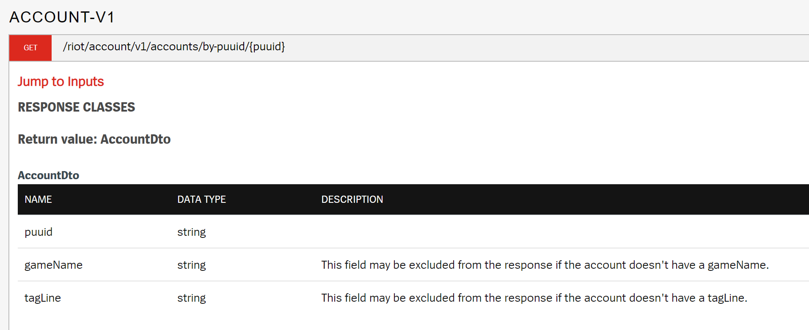

# RiotApiParser 
A small script to parse the riot api documentation to generate json schema file,
which get converted to pydantic models aka python dataclasses. For an eay and fast prototyping
of api wrappers. 
### Installation
clone or downloade the repository and install the requirements

```bash
cd RiotApiParser
pip install -r requirements.txt
```
### Run

```cmd
python main.py -h
usage: main.py [-h] [-p PARSER] [-jp JSON_PATH] [-pp PYTHON_PATH] [-u URL]

optional arguments:
  -h, --help            show this help message and exit
  -p PARSER, --parser PARSER
                        select a parser for bs4, default: lxml
  -jp JSON_PATH, --jsonpath JSON_PATH
                        Path to store the json schema file, default: models
  -pp PYTHON_PATH, --pythonpath PYTHON_PATH
                        Path to store the python file, default: python
  -u URL, --url URL     url to riot developers page with the api documentation, default: https://developer.riotgames.com/apis
```
````bash
python main.py
````
If the script run's with the default arguments, you got two folder models and python.
In the models' directory is the json schema located and in the python directory the generated
python files.

### Example
Parsing the website entry to json schema

````json
{
  "title": "AccountDto",
  "$schema": "http://json-schema.org/draft-07/schema#",
  "type": "object",
  "properties": {
    "puuid": {
      "type": "string"
    },
    "gameName": {
      "type": "string",
      "description": "This field may be excluded from the response if the account doesn't have a gameName."
    },
    "tagLine": {
      "type": "string",
      "description": "This field may be excluded from the response if the account doesn't have a tagLine."
    }
  }
}
````
Generating python code from the json schema
````python
# generated by datamodel-codegen:
#   filename:  AccountDto.json
#   timestamp: 2022-04-11T09:10:43+00:00

from __future__ import annotations

from typing import Optional

from pydantic import BaseModel, Field


class AccountDto(BaseModel):
    puuid: Optional[str] = None
    gameName: Optional[str] = Field(
        None,
        description="This field may be excluded from the response if the account doesn't have a gameName.",
    )
    tagLine: Optional[str] = Field(
        None,
        description="This field may be excluded from the response if the account doesn't have a tagLine.",
    )
````